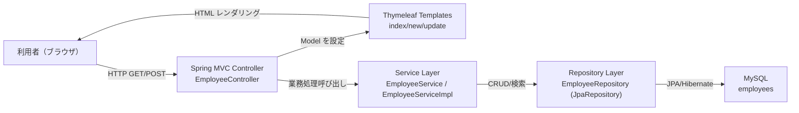

# システム全体構成図

## 採用方式（Mermaid + draw.io 併用）
- 正本（テキスト管理）: `system-overview.mmd`
- GUI 編集用: `system-overview.drawio`
- 配布用エクスポート: `export/system-overview.svg`

## 運用ルール
- 図の内容を変更する場合は、まず `system-overview.mmd` を更新する。
- GUI での編集・微調整が必要な場合は `system-overview.drawio` を更新する。
- 共有用資料として `export/system-overview.svg` を再出力する。

## 全体構成図（Mermaid ソース）

## 出力物
- Mermaid: `docs/design/system-overview.mmd`
- draw.io: `docs/design/system-overview.drawio`
- SVG: `docs/design/export/system-overview.svg`
