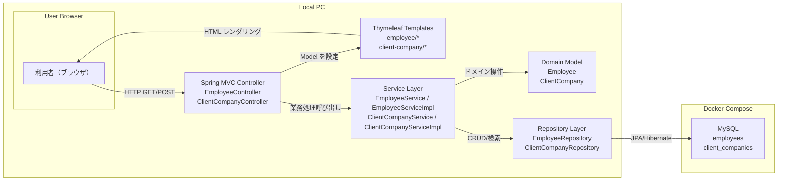

# システム全体構成図

## 採用方式（Mermaid + draw.io 併用）
- 正本（テキスト管理）: `システム全体構成図.mmd`
- GUI 編集用: `システム全体構成図.drawio`
- 配布用エクスポート: `export/システム全体構成図.svg`

## 運用ルール
- 図の内容を変更する場合は、まず `システム全体構成図.mmd` を更新する。
- GUI での編集・微調整が必要な場合は `システム全体構成図.drawio` を更新する。
- 共有用資料として `export/システム全体構成図.svg` を再出力する。

## 構成の見方
- 本図は、ローカル開発環境を前提とした実行構成を表す。
- `Local PC` 上でブラウザと Spring Boot アプリケーションが動作する。
- データベースは Docker Compose 管理の MySQL コンテナ上で動作する。
- 利用者はブラウザから HTTP でアプリへアクセスし、Thymeleaf により HTML を受け取る。
- Java アプリケーション内部では、`Employee` 系と `ClientCompany` 系の機能を Controller / Service / Repository ごとに分けて管理する。
- ドメインモデルとして `Employee` と `ClientCompany` を扱い、従業員が所属する派遣先企業を関連付けて管理する。

## 全体構成図（Mermaid ソース）

## 出力物
- Mermaid: `docs/基本設計/システム全体構成図.mmd`
- draw.io: `docs/基本設計/システム全体構成図.drawio`
- SVG: `docs/基本設計/export/システム全体構成図.svg`
